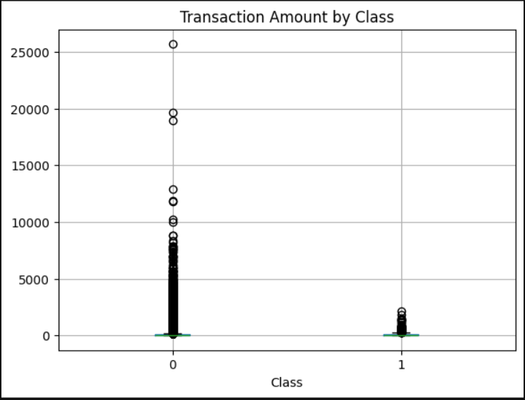
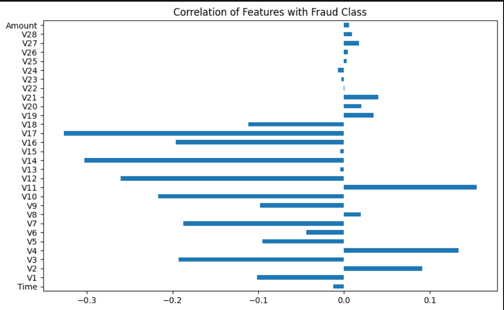
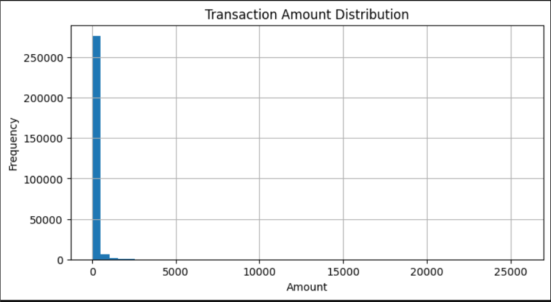
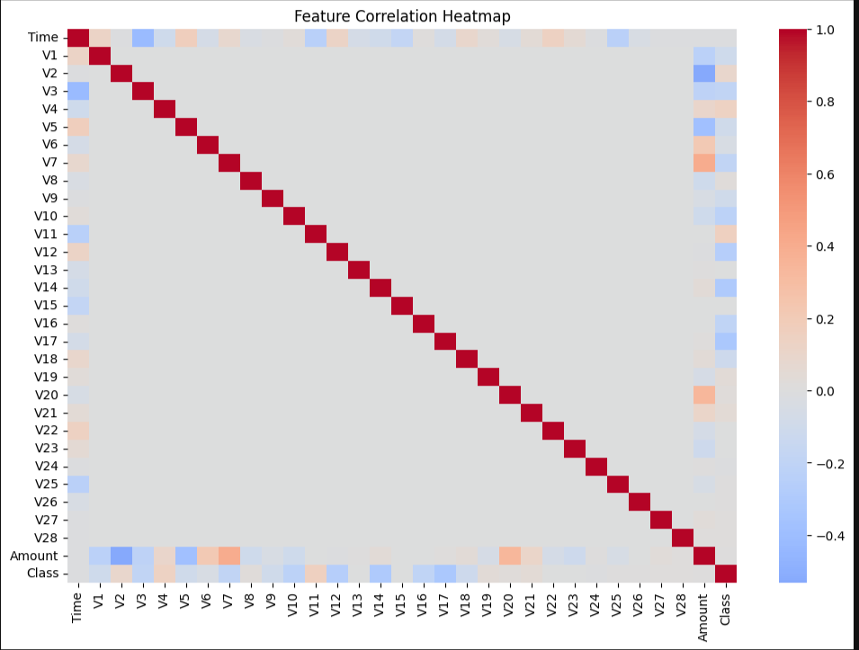
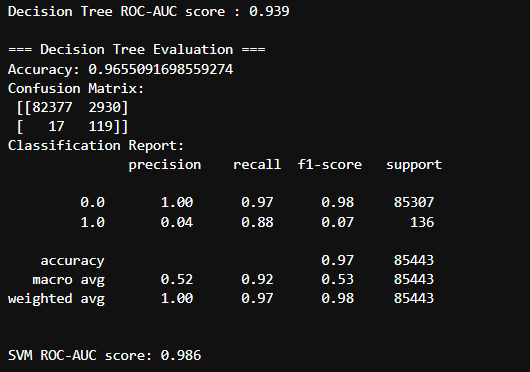
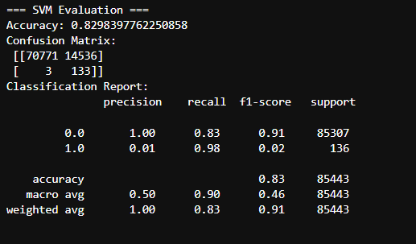

# Credit Card Fraud Detection with Decision Tree & SVM

## Project Overview
This project builds a machine learning pipeline to detect fraudulent credit card transactions using Decision Tree and SVM classifiers. Handling imbalanced data (fraud is rare), evaluating models via ROC-AUC, confusion matrices, and classification metrics.

---

## 📝 Objectives
- Perform Exploratory Data Analysis (EDA) to understand patterns and class imbalance  
- Preprocess data (standardization, normalization, train/test split, handling class imbalance)  
- Train & compare two models: Decision Tree (interpretable) vs. SVM (with class balancing)  
- Evaluate with metrics: Accuracy, Precision, Recall, F1-Score, ROC-AUC  
- Suggest future improvements  

---

## 📁 Dataset
- ~284,807 transactions, 31 features including anonymized PCA features and `Amount`, `Time`.  
- Severe class imbalance (~0.2% fraud vs ~99.8% non-fraud).  

---

## 🔍 Exploratory Data Analysis (EDA)

### Fraud Class Distribution  
Shows the imbalance between non-fraud and fraud transactions.  
  

### Correlation of Features with Fraud  
Bar plot of how each feature correlates with the `Class` label.  
  

### Transaction Amount Distribution  
How amounts are distributed overall — heavy skew toward smaller values.  
  

### Transaction Amount by Class  
Comparison of transaction amount distributions by class (fraud vs non-fraud).  
  

### Feature Correlation Heatmap  
Full feature correlation matrix — helps understand multicollinearity or redundancies.  
  

---

## ⚙️ Model Training & Evaluation

### Decision Tree

- **ROC-AUC Score**: 0.939  
- **Confusion Matrix:**  
    

- **Classification Report:**  
precision recall f1-score support

0.0 … … … …
1.0 … … … …

### SVM (LinearSVC, class_weight='balanced')

- **ROC-AUC Score**: 0.986  
- **Confusion Matrix:**  
    

- **Classification Report:**  

precision recall f1-score support

0.0 … … … …
1.0 … … … …

---

## 💡 Key Insights & Conclusion

- Accuracy alone is misleading due to class imbalance.  
- Decision Tree gives interpretability but lower recall for fraud class.  
- SVM improves recall for fraud, though precision is very low → many false positives.  

---

## 🚀 Future Work

- Use ensemble methods (Random Forest, XGBoost)  
- Try resampling techniques (SMOTE, ADASYN)  
- Hyperparameter tuning (GridSearchCV, RandomSearchCV)  
- Explore other algorithms (anomaly detection, neural networks)  

---

## 🧾 File Structure

.
├── images/
│ ├── Fraud Class Distribution.png
│ ├── Correlation of Features with Fraud Class.png
│ ├── Transaction Amount Distribution.png
│ ├── Boxplot of Transaction Amounts by Class.png
│ ├── Feature Correlation Heatmap.png
│ ├── Decision Tree Evaluation Results.png
│ ├── SVM Evaluation Results.png
│ └── …
├── Credit_Card_Fraud_Detection_with_DecisionTree_and_SVM.ipynb
├── README.md
└── …
